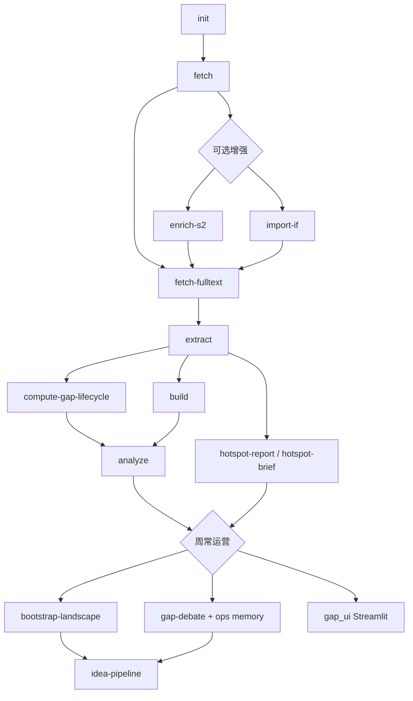

# Full-Text Workflow 完整流水线指南

> 工作目录：`fulltext_workflow/`  
> 数据库：`data/kg_fulltext.db`（独立于主程序 `data/kg_papers.db`）

也可使用配套脚本：`.\run_pipeline.ps1`（交互菜单或 `-Stage` 参数）、`.\run_gap_ui.ps1`。  
常用命令速查见 [SCRIPTS.md](SCRIPTS.md)。

---

## 0. 环境准备

```powershell
# 仓库根目录
cd D:\agent\prototype\build_kg_paper
python -m venv .venv
.\.venv\Scripts\pip install -r requirements.txt

# 全文抓取额外依赖（PDF/MinerU 回退）
.\.venv\Scripts\pip install scansci-pdf "mineru[core]"
```

`.env`（仓库根目录）最少需要：

```ini
PUBMED_EMAIL=your@email.com
PUBMED_API_KEY=your-ncbi-key          # 推荐

DASHSCOPE_API_KEY=sk-xxx              # 或 OPENAI_API_KEY
OPENAI_API_BASE=https://dashscope.aliyuncs.com/compatible-mode/v1
LLM_MODEL=deepseek-v4-flash
LLM_MODEL_EXTRACT=deepseek-v4-flash   # extract 章节抽取
LLM_MODEL_AGENT=qwen3.7-plus          # gap-debate / idea-pipeline / gap_ui / hotspot-brief

# 可选：引用 enrichment 提供商（S2 403 时用 openalex）
CITATION_PROVIDER=auto

# 可选：IF 导入年份标签（默认 2024，对应 data/jcr.csv 的 2024JIF 列）
JCR_IF_YEAR=2024

# 可选：方信病理 API（idea-pipeline / gap_ui 数据可行性）
PATHOLOGY_API_BASE_URL=http://ai.gzfxyl.cn/api/v1/pathology
PATHOLOGY_API_KEY=your-key

# 可选：周常 ops memory（默认开启）
OPS_MEMORY_ENABLED=1
OPS_MEMORY_LOOKBACK_RUNS=4
```

进入工作目录：

```powershell
cd fulltext_workflow
$py = "..\.venv\Scripts\python.exe"
```

检索范围来自仓库根目录 `search_queries.py`（默认 **2015–2025**、15 组查询）。可用环境变量覆盖年份：

```ini
FULLTEXT_SEARCH_YEAR_START=2015
FULLTEXT_SEARCH_YEAR_END=2026
FETCH_EDAT_DAYS=14                     # 设后 fetch 默认带 EDAT 窗口；0=关闭
```

---

## 1. 流水线总览



| 阶段 | 命令 | 是否必需 | 说明 |
|------|------|----------|------|
| 初始化 | `init` | 首次 | 创建/迁移 SQLite 表结构（含 lifecycle / hotspot / ops_*） |
| 元数据 | `fetch` | 必需 | PubMed 查询组写入 papers |
| 引用/IF | `enrich-s2` / `import-if` | 可选 | Gap 影响力加权；纯 KG 可跳过 |
| 全文 | `fetch-fulltext` | 推荐 | JATS → PDF/MinerU → unavailable |
| 抽取 | `extract` | 必需 | LLM 按章节抽三元组（默认 core-only） |
| 生命周期 | `compute-gap-lifecycle` | Gap 推荐 | limitation 时间画像 + 填补信号 |
| 建图 | `build` | 必需 | NetworkX → GEXF + HTML |
| 分析 | `analyze` | 推荐 | 静态 SQL Gap 报告 |
| 周热点 | `hotspot-report` / `hotspot-brief` | 周更推荐 | 入库窗口热点 + WoW + LLM 简报 |
| 辩论/方案 | `gap-debate` / `idea-pipeline` | 可选 | 默认读写 ops memory；需 LLM |
| UI | `streamlit run gap_ui.py` | 可选 | 七标签页交互分析 |
| **建库一键** | `run-db` | 可选 | fetch → enrich → import-if → fulltext → extract |
| **每周一键** | `run_pipeline.ps1 -Stage weekly` | 周更 | EDAT 增量 + 抽取 + 热点 + build/analyze |

**运营节奏（约每 1–2 周）**：增量入库 → 周热点 → Gap 辩论（ops soft-dedup）→ 可选可行性 / 研究方案。

---

## 2. 分步命令（推荐顺序）

### Phase 1 — 数据入库

```powershell
# 1.1 初始化数据库
& $py main.py init

# 1.2 拉取 PubMed 元数据（支持断点续传，默认跳过已有 PMID）
& $py main.py fetch

# 1.2b 每周增量：只搜 PubMed 最近入库（EDAT）的文献
& $py main.py fetch --since-days 14
# 或在 .env 设 FETCH_EDAT_DAYS=14 后直接 python main.py fetch

# 1.3 【另一终端】实时查看 fetch 进度（tqdm 在 Cursor 终端可能不刷新）
& $py main.py watch-fetch
& $py main.py watch-fetch --once          # 只看一次
& $py main.py watch-fetch -i 5            # 每 5 秒刷新

# 1.4 查看库统计
& $py main.py stats
```

**模块**：`fetcher/pubmed_fetcher.py`  
**作用**：按 `search_queries.py` 启用查询组拉取标题、摘要、MeSH、期刊、作者等，写入 `papers` / `journals` / `authors`。

---

### Phase 2 — 元数据增强（可选，Gap 分析前建议跑）

```powershell
# 2.1 引用数 enrichment（默认 OpenAlex；有 S2 key 可设 CITATION_PROVIDER=semantic_scholar）
& $py main.py enrich-s2

# 2.2 期刊影响因子（默认读取 data/jcr.csv，无需传路径）
& $py main.py import-if
& $py main.py import-if --if-year 2024   # 覆盖默认年份标签

# 自定义 IF 文件（可选）
& $py main.py import-if path/to/other.csv --if-year 2025
```

**数据文件**：`data/jcr.csv`（JCR 2024，列：期刊名称 / 2024JIF / Quartile / ISSN / eISSN）。路径与默认年份在 `config.py` 的 `JCR_IF_PATH`、`JCR_IF_YEAR` 中配置。

**模块**：`fetcher/citation_fetcher.py`、`utils/if_importer.py`  
**作用**：填充 `papers.citation_count`、`open_access`；期刊 `impact_factor` / `quartile`。供 `gap_tools` 的 `impact_score`、`cross_priority_score` 使用。

**验证**（`stats` 输出）：

| 字段 | 含义 |
|------|------|
| `s2_enriched` / `citations_openalex` | 已 enrichment 引用数的论文数 |
| `journals_with_if` | 已导入 IF 的期刊数 |

若 `journals_with_if = 0`，Gap 工具的 `avg_if`、`impact_score` 仅反映引用量（约 60% 权重），需先跑 `import-if`。

---

### Phase 3 — 全文获取

```powershell
& $py main.py fetch-fulltext
```

**模块**：`fetcher/fulltext_fetcher.py`  
**作用**：三级策略：

1. Europe PMC JATS XML → `raw/pmc_xml/` + `document_sections`
2. ScanSci PDF + MinerU → `raw/pdfs/`、`raw/mineru_output/`
3. 均失败则标记 `full_text_status=unavailable`，后续 extract 退回摘要

---

### Phase 4 — LLM 知识抽取

```powershell
# 小规模试跑（默认 limit=30；config 默认 EXTRACT_CORE_ONLY=true）
& $py main.py extract --limit 20

# 全量待处理论文（显式 core-only 推荐）
& $py main.py extract --limit 0 --core-only

# 含 introduction/other（更慢更全）
& $py main.py extract --limit 0 --all-sections

# 并行（注意 LLM 限流，默认 workers=1）
& $py main.py extract --limit 0 --section-workers 2 --paper-workers 1
```

**模块**：`extractor/section_extractor.py`、`extractor/llm_client.py`  
**作用**：按章节调用 LLM，抽取实体（Disease/Method/Task 等）和关系，写入 `entities` / `relations`，标记 `extraction_done=1`。

**辅助脚本**（抽取失败/空结果重跑）：

```powershell
& $py scripts/reset_empty_extraction.py             # 重置 extraction_done=1 但无 relations 的论文
& $py scripts/reset_empty_extraction.py --dry-run   # 仅预览
& $py scripts/fix_pmc_mismatch.py --dry-run         # 扫描 PMC 缓存 PMID/DOI 错配
& $py scripts/fix_pmc_mismatch.py                   # 清除错配全文，改回 abstract-only
```

---

### Phase 5 — Limitation 时间画像（Gap 分析前推荐）

```powershell
# 计算 limitation 时间画像 + 启发式填补信号，写入派生表
& $py main.py compute-gap-lifecycle
# 可选：保留已有 limitation_temporal 行，仅重建 resolution_signals
& $py main.py compute-gap-lifecycle --no-force
# 仅时间画像（跳过 resolution，约快 10x）：
& $py main.py compute-gap-lifecycle --temporal-only
```

**模块**：`analysis/gap_lifecycle.py`、`db/schema.py`（`limitation_temporal`、`limitation_resolution_signals`）  
**作用**：

- 按 `papers.year` 聚合每条 limitation 的 first/last year、recent_ratio、temporal_status
- 启发式检测后期 disease/task/method 跟进论文（resolution_signal: none/weak/moderate）
- 供 `limitation_temporal_profile`、`limitation_gap_status`、`combo_gap_temporal` 工具与 Gap Debate 使用

**流水线位置**：`extract` 之后、`analyze` / `gap-debate` 之前。  
**注意**：`run_pipeline.ps1 -Stage weekly` / `-Stage all` **不会**自动跑本步；全量建库或辩论前请单独执行。

---

### Phase 6 — 知识图谱构建与可视化

```powershell
# 建图 + 导出 GEXF/CSV + 生成 HTML
& $py main.py build

# 仅重新生成 HTML（DB 已有数据时）
& $py main.py viz
```

**模块**：`graph/kg_builder.py`、`viz/visualize.py`、`viz/gap_viz.py`  
**作用**：SQLite → NetworkX 图；输出：

- `output/kg_fulltext.gexf`
- `output/kg_fulltext_interactive.html`（论文-实体关系）
- `output/kg_entities.html`（实体共现投影）
- `output/papers_by_journal.csv` 等统计

Gap UI 的 **Visualization** 标签页也会读库渲染空白相关图。

---

### Phase 7 — Gap 分析与周常记忆

```powershell
# 静态 SQL 报告（无 LLM）
& $py main.py analyze
# 输出：output/gap_report.md

# LLM 多智能体辩论报告（默认注入 + 持久化 ops memory）
& $py main.py gap-debate --focus "digital pathology" --top 6 -o output/gap_debate_report.md
# 关闭记忆：--no-ops-memory / --no-ops-persist
```

**角色**（界面英文标签 / 代码内部名）：

| UI 标签 | 内部 key | 职责 |
|---------|----------|------|
| Opportunity Scout | optimist | 从 KG 提名候选空白 |
| Evidence Reviewer | skeptic | 独立核验真假空白与置信度 |
| Final Synthesizer | moderator | 综合定稿或发起下一轮 |

**Ops memory**（`analysis/ops_memory.py`）：

- 按 `focus_key`（无 focus → `__all__`）回看最近 **4** 次空白，prompt **软避让**近重复方向（非硬过滤）
- 成功跑完后写入 `ops_runs` / `ops_gap_items` / `ops_proposals`
- Gap UI sidebar：`Use ops memory`、`Persist this run`（默认开）
- 维护：`scripts/clear_ops_memory.py`（清空）、`scripts/backfill_ops_proposals.py`（回填缺失字段）

**模块**：`analysis/gap_tools.py`、`analysis/graph_tools.py`、`analysis/ops_memory.py`、`analysis/disease_synonyms.py`、`analysis/focus_filter.py`、`gap_agent.py`、`debate_labels.py`

**Research focus / 中英文同义词**（`analysis/disease_synonyms.py`）：

- Gap UI / CLI 的 focus 支持中文疾病名（如 `肠息肉`），解析为 canonical 概念后在 SQL 中展开英文短语与同义词
- 已覆盖：胃癌、肺腺癌/肺癌、结直肠癌/肠癌、结直肠息肉/腺瘤、肠炎、淋巴瘤、胃溃疡、胃息肉、肝癌、乳腺癌、鼻咽癌等；未命中时回退字面 `LIKE`
- 方信 `DiseaseCode` 与概念对齐（如 `C_XR` 肠息肉、`BY_BNAI` 鼻咽癌、`F_FA` 肺癌）；Gap 可行性映射优先走方信编码
- UI 在 Research focus 下方显示 `Resolved: …`；无映射时中文输入会提示尝试英文名
- 验收：`tool_corpus_focus_coverage(focus="肠息肉")` 应与 `colorectal polyp` 同量级（生产库约 30+ 篇）

---

### Phase 8 — 数据可行性 + 研究假说（进阶）

```powershell
# 8.1 从方信 API 加载病理数据景观到 SQLite
& $py main.py bootstrap-landscape
& $py main.py bootstrap-landscape --force    # 强制重载

# 8.2 端到端：Gap 辩论 → 可行性核验 → 假说生成（同样默认 ops memory）
& $py main.py idea-pipeline --focus radiomics --top 3 -o output/idea_pipeline_report.md

# 仅可行性（跳过辩论和假说 LLM）
& $py main.py idea-pipeline --skip-debate --gap-report output/gap_debate_report.md --skip-ideas
```

**模块**：`pipeline.py`、`feasibility/`、`idea_agent.py`、`evolution_agent.py`  
**作用**：结合 LIS 队列数据评估研究空白的数据可行性，Generator × Critic 迭代产出研究方案。

---

### Phase 9 — 交互式 UI

```powershell
.\run_gap_ui.ps1
# 或
..\.venv\Scripts\streamlit.exe run gap_ui.py
```

浏览器打开 `http://localhost:8501`。操作细节见 [gap_ui_guide.md](gap_ui_guide.md)。

**七个主标签页**：

| 标签 | 内容 |
|------|------|
| Debate Process | 三角色辩论过程与工具调用 |
| Weekly Hotspot | 周热点榜 / WoW / emerging × gap / LLM 简报 |
| Visualization | Gap / 实体可视化 |
| Evidence & Literature | 证据与文献列表 |
| Gap Report | 可下载辩论报告 |
| Data Feasibility (Fangxin LIS) | 方信数据可行性 |
| Research Proposal | Generator × Critic 方案 |

---

## 3. 一键流水线

### 3.1 仅建库（`run-db`）

只填充 `kg_fulltext.db`，不含建图、Gap 分析、辩论：

```powershell
# 默认：fetch → enrich-s2 → import-if → fetch-fulltext → extract
& $py main.py run-db

# 增量 fetch + 核心章节抽取
& $py main.py run-db --since-days 14 --core-only

# 跳过引用/IF（纯元数据 + 全文 + 抽取）
& $py main.py run-db --skip-enrich

# 试跑抽取 30 篇
& $py main.py run-db --limit 30
```

PowerShell 脚本等价：

```powershell
.\run_pipeline.ps1 -Stage db
.\run_pipeline.ps1 -Stage db -SinceDays 14 -CoreOnly
.\run_pipeline.ps1 -Stage db -SkipEnrich
```

### 3.2 完整流水线（`run-all` / `-Stage all`）

```powershell
# main.py run-all：fetch → fetch-fulltext → extract → build → analyze → stats
# 不含 enrich-s2 / import-if / lifecycle / hotspot / bootstrap-landscape
& $py main.py run-all --limit 30

# run_pipeline.ps1 -Stage all：额外含 init + enrich-s2 + import-if
.\run_pipeline.ps1 -Stage all
.\run_pipeline.ps1 -Stage all -SkipEnrich
```

---

## 4. 模块对照表

| 目录/文件 | 作用 |
|-----------|------|
| `config.py` | 路径、API Key、LLM/MinerU/引用、JCR、hotspot、ops memory |
| `db/schema.py` | SQLite 表定义、upsert、统计、迁移 |
| `fetcher/pubmed_fetcher.py` | PubMed Entrez 元数据抓取 |
| `fetcher/fulltext_fetcher.py` | JATS / PDF / MinerU 全文 |
| `fetcher/citation_fetcher.py` | OpenAlex/S2 引用数 enrichment |
| `extractor/section_extractor.py` | 按章节 LLM 抽取 |
| `extractor/llm_client.py` | 百炼/DeepSeek API 调用与限流 |
| `graph/kg_builder.py` | 构建 NetworkX 知识图谱 |
| `viz/visualize.py` | Pyvis HTML 可视化 |
| `viz/gap_viz.py` | Gap UI 可视化 |
| `analysis/gap_tools.py` | SQL Gap 工具 + impact 加权 |
| `analysis/impact_scoring.py` | citation/IF → impact_score |
| `analysis/gap_lifecycle.py` | limitation 时间画像与填补信号 |
| `analysis/weekly_hotspot.py` | 每周入库热点（velocity + emerging_score + WoW） |
| `analysis/hotspot_brief.py` | LLM 热点周报简报 |
| `analysis/ops_memory.py` | 周常 gap/proposal 持久化与软避让 |
| `analysis/feasibility_tools.py` | 病理数据可行性 LLM 工具 |
| `analysis/graph_tools.py` | 实体图分析（PageRank/社区/可达性） |
| `gap_agent.py` | Gap 辩论多智能体 |
| `debate_labels.py` | 辩论角色 UI 文案映射 |
| `idea_agent.py` | 研究方案 Generator × Critic |
| `pipeline.py` | idea-pipeline 编排 |
| `feasibility/` | 方信病理 LIS HTTP 客户端 |
| `gap_ui.py` | Streamlit 七标签页 UI |
| `utils/fetch_progress.py` | watch-fetch 进度轮询 |
| `utils/if_importer.py` | 期刊 IF 导入 |
| `scripts/reset_empty_extraction.py` | 重置空抽取结果 |
| `scripts/reset_extraction.py` | 重置全部已抽取结果 |
| `scripts/fix_pmc_mismatch.py` | 修复 PMC 缓存错配 |
| `scripts/clear_ops_memory.py` | 清空 ops memory（可按 focus） |
| `scripts/backfill_ops_proposals.py` | 回填 ops_proposals 缺失字段 |
| `SCRIPTS.md` | 常用脚本速查 |

---

## 5. 关键数据路径

| 路径 | 内容 |
|------|------|
| `data/kg_fulltext.db` | 主数据库 |
| `data/jcr.csv` | 默认 JCR 影响因子表（`import-if` 读取） |
| `raw/pmc_xml/` | PMC JATS 缓存 |
| `raw/pdfs/` | ScanSci 下载的 PDF |
| `raw/mineru_output/` | MinerU 解析结果 |
| `output/kg_fulltext.gexf` | 图导出 |
| `output/kg_fulltext_interactive.html` | 交互式 KG |
| `output/gap_report.md` | 静态 Gap 报告 |
| `output/gap_debate_report.md` | 辩论 Gap 报告 |
| `output/idea_pipeline_report.md` | 假说流水线报告 |
| `output/weekly_hotspot_{week_id}.md` | 周热点报告 |

---

## 6. 推荐生产跑法（全量首跑）

```powershell
cd fulltext_workflow
$py = "..\.venv\Scripts\python.exe"

& $py main.py init
& $py main.py fetch                              # 耗时长，另开终端 watch-fetch
& $py main.py enrich-s2                          # 可选但 Gap 推荐
& $py main.py import-if                          # 可选，默认 data/jcr.csv
& $py main.py fetch-fulltext                     # 耗时长
& $py main.py extract --limit 0 --core-only      # 全量，核心章节
& $py main.py compute-gap-lifecycle              # limitation 时间画像 + 填补信号
& $py main.py build
& $py main.py analyze
& $py main.py bootstrap-landscape --force        # 若用 idea-pipeline / gap_ui 可行性
& $py main.py gap-debate -o output/gap_debate_report.md
& $py main.py stats
```

---

## 7. 每周增量更新

首跑完成后，建议每周执行一次以追踪新文献。核心机制：

- `fetch` 默认 **resume**：已入库 PMID 自动跳过
- `--since-days N`：附加 `("last N days"[EDAT])`，只检索 PubMed **最近入库**记录
- `fetch-fulltext` / `extract` 天然只处理新增待处理论文

`.env` 可选默认值：

```ini
FULLTEXT_SEARCH_YEAR_END=2026          # 每年 1 月更新
FETCH_EDAT_DAYS=14                     # 设后 fetch 默认带 EDAT 窗口；0=关闭
HOTSPOT_WINDOW_DAYS=14                 # weekly 热点检测窗口（默认跟 FETCH_EDAT_DAYS）
HOTSPOT_PRIOR_WINDOW_DAYS=14           # 上一窗口，用于算 velocity
HOTSPOT_MIN_RECENT_PAPERS=2            # 实体至少 N 篇新入库论文才上榜
OPS_MEMORY_ENABLED=1
OPS_MEMORY_LOOKBACK_RUNS=4
```

### 7.1 一键周更（与脚本一致）

```powershell
.\run_pipeline.ps1 -Stage weekly
# 等价步骤：
#   fetch --since-days 14
#   enrich-s2（可用 -SkipEnrich 跳过）
#   fetch-fulltext
#   extract --core-only
#   hotspot-report
#   hotspot-brief
#   build → analyze → stats
```

或分步：

```powershell
& $py main.py fetch --since-days 14
& $py main.py enrich-s2
& $py main.py fetch-fulltext
& $py main.py extract --limit 0 --core-only
& $py main.py hotspot-report              # 近期研究热点报告 + 快照持久化
& $py main.py hotspot-brief               # LLM 一页趋势简报（LLM_MODEL_AGENT）
& $py main.py build
& $py main.py analyze
# 辩论前建议（weekly 脚本不含）：
& $py main.py compute-gap-lifecycle --temporal-only
& $py main.py gap-debate --focus "your topic" -o output/gap_debate_report.md
```

**不要**每周使用 `--no-resume` 或对勘误文跑 `reset_empty_extraction`。

### 7.2 Weekly Hotspot

基于 `papers.created_at` 入库窗口 + velocity（与全库 `hotspot_entities` 不同）。输出：`output/weekly_hotspot_{week_id}.md`。

**表结构**（`kg_fulltext.db`）：

| 表 | 作用 |
|----|------|
| `weekly_hotspot_runs` | 每周元数据（week_id、窗口、入库论文数、报告路径） |
| `weekly_hotspot_snapshots` | 各榜单行（board、item_key、rank、score、top_pmids） |

**board 类型**：`method` / `disease` / `task` / `combo` / `limitation`  
**combo 的 item_key**：`{method}|{disease}`

一次性 bulk 入库时 prior 窗口常为空，周环比应依赖**持久化快照**。

**周环比**（`compare_with_previous_week`）：

| 信号 | 定义 |
|------|------|
| New entrants | 本周 Top N 有、上周快照无 |
| Cooled | 上周 Top N 有、本周 Top N 无 |
| Rank changes | 两周均上榜，排名变化 ≥3 |

`hotspot-report` 默认 **先对比、再写报告、再持久化** 本周快照。第二次起报告含 `## Week-over-Week` 节。

```powershell
& $py main.py hotspot-report                    # 持久化快照
& $py main.py hotspot-report --no-persist       # 仅报告，不写库
& $py main.py compute-weekly-hotspots           # 仅打印摘要，不写 md
```

相关工具与 UI：

- **emerging_gap_opportunities**：`opportunity_score = emerging_score + literature_gap 分档`
- **hotspot-brief**：热点 JSON → 中文周报摘要
- **gap_ui → Weekly Hotspot**：方法/病种/组合/交叉机会 + WoW + 一键简报

### 7.3 Ops memory（周常软去重）

| 表 | 作用 |
|----|------|
| `ops_runs` | 一次辩论/方案会话（focus_key、week_id、报告路径、hotspot 关联） |
| `ops_gap_items` | 解析出的空白条目 + fingerprint |
| `ops_proposals` | 关联研究方案（含 `feasibility_score` 0–1、`critic_score` 0–10） |

后续同 focus 的 `gap-debate` / `idea-pipeline` / `gap_ui` 默认读取最近 4 次条目，prompt 引导规避近重复（可标 `revisited`）。设计说明见 `docs/superpowers/specs/2026-07-15-ops-memory-design.md`。

```powershell
# 预览 / 清空（不影响 papers、KG、hotspot）
& $py scripts/clear_ops_memory.py
& $py scripts/clear_ops_memory.py --focus "breast cancer" --yes
& $py scripts/clear_ops_memory.py --yes --delete-files

# 一次性回填历史 proposal 链接字段
& $py scripts/backfill_ops_proposals.py
```

---

## 8. run_pipeline.ps1 用法

```powershell
.\run_pipeline.ps1                          # 交互菜单（含 d = run-db）
.\run_pipeline.ps1 -Stage db                # 仅建库流水线
.\run_pipeline.ps1 -Stage db -CoreOnly      # 建库 + 核心章节抽取
.\run_pipeline.ps1 -Stage all               # init + fetch + enrich + fulltext + extract + build + analyze
.\run_pipeline.ps1 -Stage enrich            # 仅引用 + IF 导入
.\run_pipeline.ps1 -Stage all -SkipEnrich   # 跳过引用/IF
.\run_pipeline.ps1 -Stage extract -ExtractLimit 20 -CoreOnly
.\run_pipeline.ps1 -Stage weekly            # 每周增量（EDAT 14 天 + hotspot-report/brief + build/analyze）
.\run_pipeline.ps1 -Stage fetch -SinceDays 14  # 仅增量 fetch
.\run_pipeline.ps1 -Stage debate            # gap-debate → output/gap_debate_report.md
.\run_pipeline.ps1 -Stage landscape         # bootstrap-landscape --force
```

交互菜单对应：`1` init … `9` debate，`0` quick（run-all limit=30），`d` run-db，`s` stats。
